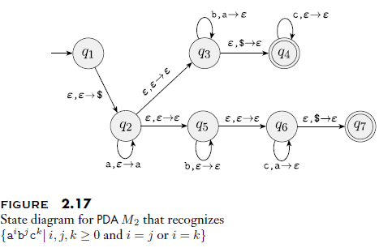
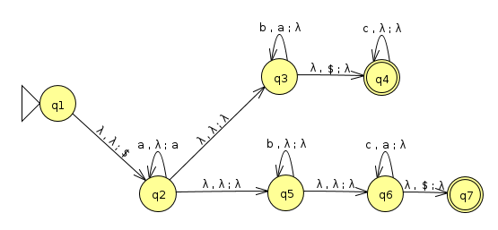
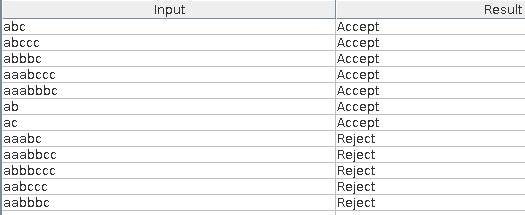
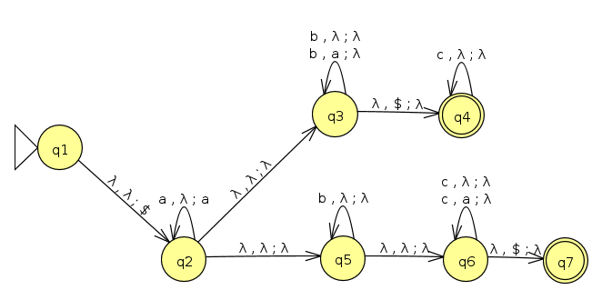
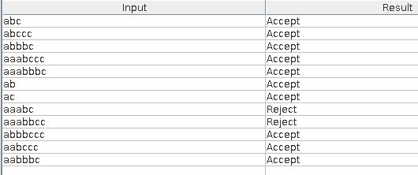

% CSC720 Homework 2
% Jon Craton
% March 13, 2018

Due Date: Tuesday, Mar 13, 2018 By Midnight

## Problem 1 (20 points)

1.29 Use the pumping lemma to show that the following languages are not regular.

a\. A₁ = { 0ⁿ1ⁿ2ⁿ|n ≥ 0 }

This will be solved by applying a proof by contradiction and the pumping lemma.

Assume that A is a regular language. Let p be the pumping length from the pumping lemma. Let s be the string 0<sup>p</sup>1<sup>p</sup>2<sup>p</sup>. s is a member of A and |s| ≥ p, so the pumping lemma for regular languages applies.

The pumping lemma for regular languages states that s can be partitioned as xyz such that xyⁱz∈A where i≥0. Additionally, |y| > 0 and |xy| ≤ p. When considering the possible partition schemes for s, we see that only y=0<sup>k</sup> where k>0 and k≤p satisfies the conditions that |y| > 0 and |xy| ≤ p.

The pumping lemma tells us that xyⁱz∈A for all i≥0. However, for i=0, the zero component is completely removed from our string while 1<sup>k</sup>2<sup>k</sup> remains. The generated string is not a member of the language for all k, therefore, A is not a regular language by contradiction.

b\. A₂ = { www|w ∈ {a,b}* }

This will be solved by applying a proof by contradiction and the pumping lemma.

Assume that A is a regular language. Let p be the pumping length from the pumping lemma. Let s be the string a<sup>p</sup>a<sup>p</sup>a<sup>p</sup>. s is a member of A and |s| ≥ p, so the pumping lemma for regular languages applies.

The pumping lemma for regular languages states that s can be partitioned as xyz such that xyⁱz∈A where i≥0. Additionally, |y| > 0 and |xy| ≤ p. When considering the possible partition schemes for s, we see that only x=ɛ,y=a<sup>k</sup>,z=a<sup>k</sup>a<sup>k</sup> where k>0 and k≤p satisfies the conditions that |y| > 0 and |xy| ≤ p.

The pumping lemma tells us that xyⁱz∈A for all i≥0. However, for i=0, the first copy of our language w is completely removed from our string while a<sup>k</sup>a<sup>k</sup> remains. The generated string is not a member of the language for all k (when p=1, the string contains a number of a's that is not a multiple of 3), therefore, A is not a regular language by contradiction.

## Problem 2 (20 points)

2.4 Give context-free grammars that generate the following languages. In all parts the alphabet Σ is {0, 1}.

b\. {w | w starts and ends with the same symbol}


```python
from nltk import CFG

grammar = CFG.fromstring("""
S -> '0' Any '0'
S -> '1' Any '1'
S -> '0' | '1'
Any -> '0' Any
Any -> '1' Any
Any ->
""")

from nltk.parse.generate import generate

print([''.join(s) for s in generate(grammar, depth=5)])
```

```
['00000', '00010', '0000', '00100', '00110', '0010', '000', '01000',
'01010', '0100', '01100', '01110', '0110', '010', '00', '10001',
'10011', '1001', '10101', '10111', '1011', '101', '11001', '11011',
'1101', '11101', '11111', '1111', '111', '11', '0', '1']
```


c\. {w | the length of w is odd|


```python
grammar = CFG.fromstring("""
S -> OneCount EvenCount
OneCount -> '0' | '1'
EvenCount -> OneCount OneCount
EvenCount -> 
""")

print([''.join(s) for s in generate(grammar, depth=5)])
```

```
['000', '001', '010', '011', '0', '100', '101', '110', '111', '1']
```


## Problem 3 (10 points)

Figure 2.17 shows a push down automata which recognizes {a<sup>i</sup>b<sup>j</sup>c<sup>k</sup>| i, j, k≥0 and i=j or i=k}. Please design and draw a new push down automata which recognizes {a<sup>i</sup>b<sup>j</sup>c<sup>k</sup>| i, j, k≥0 and i≥j or i≥k}.



Here's the orignal in JFLAP:



Basically, this needs to be amended to also accept i > j or i > k. Let's make sure the orignal does what we expect first:



Now we need to add a few transitions to allow the machine to be able to loop after it has met the desired conditions:



Now we see that our test for the new mode are passing:



## Problem 4 (10 points)

2.14 Convert the following CFG into an equivalent CFG in Chomsky normal form, using the procedure given in Theorem 2.9.

    A→BAB|B|ε
    B→00|ε

Step 1: Rename start variable

    A₀→A
    A→BAB|B|ε
    B→00|ε

Step 2: Remove ε rules

For B:

    A₀→A
    A→BAB|B|ε|A
    B→00

Then for A:

    A₀→A
    A→BAB|B|A|BB
    B→00

We are allowed an ε rule for the start state, and in this case we need it.

    A₀→A|ε
    A→BAB|B|A|BB
    B→00

Step 3: Remove unit rules

A→A:

    A₀→A|ε
    A→BAB|B|BB
    B→00

A→B:

    A₀→A|ε
    A→BAB|00|BB
    B→00

A₀→A:

    A₀→BAB|00|BB|ε
    A→BAB|00|BB
    B→00

Step 4: Convert rules to proper form

    A₀→BB₁|00|BB|ε
    A→BB₁|00|BB
    B₁→AB
    B→00

I'm not sure if "00" counts as a single non-terminal in this case. Just in case it does not, I'll create a separate rule so that "0" is the only non-terminal.

    A₀→BB₁|ZZ|BB|ε
    A→BB₁|ZZ|BB
    B₁→AB
    B→ZZ
    Z→0

Just to check our work, let's weakly verify that the starting form and CNF generate the same language:


```python
start = CFG.fromstring("""
A -> B A B | B |
B -> '0' '0'|
""")

cnf = CFG.fromstring("""
A0 -> B B1 | Z Z | B B |
A  -> B B1 | Z Z | B B
B1 -> A B
B  -> Z Z
Z  -> '0'
""")

from nltk.parse.chart import ChartParser

def is_equivalent(a, b, flipped=False):
  """ 
  Quick check to see if two grammars are equivalent.

  There's likely a proper algorithm for formally verifying that two 
  grammars are equivelent. This doesn't attempt anything like that.

  It simply creates a number of utterances with grammar a and confirms
  they can be parsed by grammar b. This function cannot guarantee that
  two grammars are equivalent, but if it returns False, the grammars are
  definitely different.
  """

  parser = ChartParser(a)
  
  for s in generate(b, depth=5):
    if len(list(parser.parse(s))) == 0:
      print("Unable to parse %s" % s)
      return False

  return flipped or is_equivalent(b,a,flipped=True)

is_equivalent(start, cnf)
```

```
True
```


## Problem 5 (10 points)

2.30 Use the pumping lemma to show that the following languages are not context free.

a\. A = { 0ⁿ1ⁿ0ⁿ1ⁿ | n≥0 }

This will be solved by applying a proof by contradiction and the pumping lemma for context-free languages.

Assume that A is a context-free language. Let p be the pumping length from the pumping lemma for context-free languages. Let s be the string 0<sup>p</sup>1<sup>p</sup>0<sup>p</sup>1<sup>p</sup>. s is a member of A and |s| ≥ p, so the pumping lemma for context-free languages applies.

The pumping lemma for context-free languages states that s can be partitioned as uvxyz such that uvⁱxyⁱz∈A for all i≥0. Additionally, |vy| > 0 and |vxy| ≤ p. When considering the possible partition schemes for s, we see that v or y must be either 0<sup>k</sup> or 1<sup>k</sup> as these are the only values that satisfy the conditions |vy| > 0 and |vxy| ≤ p. 

The pumping lemma tells us that uvⁱxyⁱz∈A for all i≥0. Pumping either of the possible values for v or y to anything other than i=1 produces a string with an unbalanced number of 1s and 0s. This sting is not a member of the language, therefore, A is not a context-free language by contradiction.

## Problem 6 (10 points)

Answer the following two questions:

a.  Briefly describe how regular language is used for lexical analysis
    in a compiler.

Regular language is commonly used in lexical analysis to convert segments of text (lexemes) into tokens. If a segment of text matches a token rule, it is converted to a token. Tokens have a both a name and a value.

For example, take the following text from a c-like langauge:

    if ( a == 12 ) { return 42 }

A lexer may contain regular language rules to match against the string such as:

    if     →   IF
    return →   RETURN
    (      →   OPEN_P
    )      →   CLOSE_P
    ==     →   IS_EQUAL
    {      →   OPEN_B
    }      →   CLOSE_B
    \d+    →   INT_LITERAL
    *      →   NAME

The lexer then converts the string to a list of (name, value) duples such as:

    (IF, 'if')
    (OPEN_P, '(')
    (NAME, 'a')
    (IS_EQUAL, '==')
    (INT_LITERAL, '12')
    (CLOSE_P, ')')
    (OPEN_B, '{')
    (RETURN, 'return')
    (INT_LITERAL, '42')
    (CLOSE_B, '}')

In this way, the lexer uses regular language to convert lexemes matching a particular langage to tokens.

b.  Briefly describe how context free language is used for parsing
    (syntax analysis) in a compiler.

Once tokenized, the syntax of a text can be parsed. The overall syntax of many common programming langauges is context-free, so the syntax is matched to a context-free grammar.

Considering the above example, we may have grammar rules such as the following. Note that terminals here are the token names from above.

    STMT → IF_STMT | RETURN_STMT
    RETURN_STMT → RETURN EXPR
    IF_STMT → IF CONDITION BLOCK
    CONDITION → OPEN_P EXPR CLOSE_P
    BLOCK → OPEN_B STMT CLOSE_B
    EXPR → EXPR OP EXPR | INT_LITERAL
    OP → IS_EQUAL

These rules are used to parse the tokens into a parse tree that can be easily interpretted or compiled to machine code.

## Problem 7 (20 points)

The completed code for this assignment is in the [q1](https://github.com/jncraton/csc720-hw2/tree/master/q1), [q2](https://github.com/jncraton/csc720-hw2/tree/master/q2), and [q3](https://github.com/jncraton/csc720-hw2/tree/master/q3) directories.

## Problem 7a (4 points)

When you use gcc compile a program, e.g., hello.c

`gcc hello.c –o hello`

It will create a binary file. You can also check the temporary output
files created by gcc using option –save-temps. Try

`gcc hello.c –o hello –save-temps`

and find out what intermediate output files can be produced by gcc.
Briefly describe each intermediate output file.

A typical C compilation pipeline is handled in 4 phases:

### 1. Pre-processor (hello.i)

The pre-processor expands macros and handles includes. In a nutshell, it takes care of anything starting with `#`. With `--save-temps` the output of this phase is stored in `hello.i`. This output is valid C code. After this stage, our `hello.c` program is still fundamentally the same with a lot of `#include` inlining:

    # 1 "hello.c"
    # 1 "<built-in>"
    # 1 "<command-line>"
    # 1 "/usr/include/stdc-predef.h" 1 3 4
    # 1 "<command-line>" 2
    
    ... (trimmed ~1900 lines)

    void main()
    {
     printf("hello world\n");
    }


### 2. Compiler (hello.s)

The compiler converts pre-processed C code into assembly instructions. It's worth noting that while an intermediate human-readable representation is handy, it isn't strictly necessary. Compilation could output machine code directly, but using intermediate assembly modularizes the tool chain. Also, because C allows inline assembly, you need a full assembler in either case. This intermediate representation also doesn't need to actually be assembly language instructions for the target platform. For example, LLVM uses a platform independent intermediate representation.

The output of this step is stored in `hello.s`, and is stored as assembly instructions still viewable as text:

    .file	"hello.c"
    .section	.rodata
    .LC0:
    .string	"hello world"
    .text
    .globl	main
    .type	main, @function
    main:
    .LFB2:
    .cfi_startproc
    pushq	%rbp
    .cfi_def_cfa_offset 16
    .cfi_offset 6, -16
    movq	%rsp, %rbp
    .cfi_def_cfa_register 6
    movl	$.LC0, %edi
    call	puts
    nop
    popq	%rbp
    .cfi_def_cfa 7, 8
    ret
    .cfi_endproc
    .LFE2:
    .size	main, .-main
    .ident	"GCC: (Ubuntu 5.4.0-6ubuntu1~16.04.9) 5.4.0 20160609"
    .section	.note.GNU-stack,"",@progbits

### 3. Assembler (hello.o)

The assembler converts assembly instructions to machine code. The output of this stage is stored as `hello.o`. This stage is notable as this output is frequently generated as part of a "normal" build process. Typically, many C files are assembled and then linked into a single final executable.

Being machine code, we can't easily view .o files directly. GCC does include a tool called objdump to allow us to disassemble obejct files. Here's the output of `objdump -D hello.o` to demonstrate that the object file basically contains our previous assembly code as machine code:

    hello.o:     file format elf64-x86-64
     
     
     Disassembly of section .text:
     
     0000000000000000 <main>:
        0:	55                   	push   %rbp
        1:	48 89 e5             	mov    %rsp,%rbp
        4:	bf 00 00 00 00       	mov    $0x0,%edi
        9:	e8 00 00 00 00       	callq  e <main+0xe>
        e:	90                   	nop
        f:	5d                   	pop    %rbp
       10:	c3                   	retq   
     
     Disassembly of section .rodata:
     
     0000000000000000 <.rodata>:
        0:	68 65 6c 6c 6f       	pushq  $0x6f6c6c65
        5:	20 77 6f             	and    %dh,0x6f(%rdi)
        8:	72 6c                	jb     76 <main+0x76>
        a:	64                   	fs
     	...
     
     Disassembly of section .comment:
     
     0000000000000000 <.comment>:
        0:	00 47 43             	add    %al,0x43(%rdi)
        3:	43 3a 20             	rex.XB cmp (%r8),%spl
        6:	28 55 62             	sub    %dl,0x62(%rbp)
        9:	75 6e                	jne    79 <main+0x79>
        b:	74 75                	je     82 <main+0x82>
        d:	20 35 2e 34 2e 30    	and    %dh,0x302e342e(%rip)        # 302e3441 <main+0x302e3441>
       13:	2d 36 75 62 75       	sub    $0x75627536,%eax
       18:	6e                   	outsb  %ds:(%rsi),(%dx)
       19:	74 75                	je     90 <main+0x90>
       1b:	31 7e 31             	xor    %edi,0x31(%rsi)
       1e:	36 2e 30 34 2e       	ss xor %dh,%cs:(%rsi,%rbp,1)
       23:	39 29                	cmp    %ebp,(%rcx)
       25:	20 35 2e 34 2e 30    	and    %dh,0x302e342e(%rip)        # 302e3459 <main+0x302e3459>
       2b:	20 32                	and    %dh,(%rdx)
       2d:	30 31                	xor    %dh,(%rcx)
       2f:	36 30 36             	xor    %dh,%ss:(%rsi)
       32:	30 39                	xor    %bh,(%rcx)
     	...
     
     Disassembly of section .eh_frame:
     
     0000000000000000 <.eh_frame>:
        0:	14 00                	adc    $0x0,%al
        2:	00 00                	add    %al,(%rax)
        4:	00 00                	add    %al,(%rax)
        6:	00 00                	add    %al,(%rax)
        8:	01 7a 52             	add    %edi,0x52(%rdx)
        b:	00 01                	add    %al,(%rcx)
        d:	78 10                	js     1f <.eh_frame+0x1f>
        f:	01 1b                	add    %ebx,(%rbx)
       11:	0c 07                	or     $0x7,%al
       13:	08 90 01 00 00 1c    	or     %dl,0x1c000001(%rax)
       19:	00 00                	add    %al,(%rax)
       1b:	00 1c 00             	add    %bl,(%rax,%rax,1)
       1e:	00 00                	add    %al,(%rax)
       20:	00 00                	add    %al,(%rax)
       22:	00 00                	add    %al,(%rax)
       24:	11 00                	adc    %eax,(%rax)
       26:	00 00                	add    %al,(%rax)
       28:	00 41 0e             	add    %al,0xe(%rcx)
       2b:	10 86 02 43 0d 06    	adc    %al,0x60d4302(%rsi)
       31:	4c 0c 07             	rex.WR or $0x7,%al
       34:	08 00                	or     %al,(%rax)
     	...

### 4. Linker (hello)

The linker merges object file(s) into a single final executable. It adds necessary bootstraping code to start execution, handles environment variables, and grabs command line arguments among other tasks.

It converts references to external code to the correct locations. The linker may run dynamically to call into dynamically loaded dependencies, or it can be run statically to include all dependencies directly in the final binary.

The output of this stage is the final executable, `hello`. This stage is also hard to view directly, but we can still use `objdump` to convert it to assembly for debugging:

    q1/hello:     file format elf64-x86-64
    
    
    Disassembly of section .init:
    
    00000000004003c8 <_init>:
      4003c8:	48 83 ec 08          	sub    $0x8,%rsp
      4003cc:	48 8b 05 25 0c 20 00 	mov    0x200c25(%rip),%rax        # 600ff8 <_DYNAMIC+0x1d0>
      4003d3:	48 85 c0             	test   %rax,%rax
      4003d6:	74 05                	je     4003dd <_init+0x15>
      4003d8:	e8 43 00 00 00       	callq  400420 <__libc_start_main@plt+0x10>
      4003dd:	48 83 c4 08          	add    $0x8,%rsp
      4003e1:	c3                   	retq   
    
    Disassembly of section .plt:
    
    00000000004003f0 <puts@plt-0x10>:
      4003f0:	ff 35 12 0c 20 00    	pushq  0x200c12(%rip)        # 601008 <_GLOBAL_OFFSET_TABLE_+0x8>
      4003f6:	ff 25 14 0c 20 00    	jmpq   *0x200c14(%rip)        # 601010 <_GLOBAL_OFFSET_TABLE_+0x10>
      4003fc:	0f 1f 40 00          	nopl   0x0(%rax)
    
    0000000000400400 <puts@plt>:
      400400:	ff 25 12 0c 20 00    	jmpq   *0x200c12(%rip)        # 601018 <_GLOBAL_OFFSET_TABLE_+0x18>
      400406:	68 00 00 00 00       	pushq  $0x0
      40040b:	e9 e0 ff ff ff       	jmpq   4003f0 <_init+0x28>
    
    0000000000400410 <__libc_start_main@plt>:
      400410:	ff 25 0a 0c 20 00    	jmpq   *0x200c0a(%rip)        # 601020 <_GLOBAL_OFFSET_TABLE_+0x20>
      400416:	68 01 00 00 00       	pushq  $0x1
      40041b:	e9 d0 ff ff ff       	jmpq   4003f0 <_init+0x28>
    
    Disassembly of section .plt.got:
    
    0000000000400420 <.plt.got>:
      400420:	ff 25 d2 0b 20 00    	jmpq   *0x200bd2(%rip)        # 600ff8 <_DYNAMIC+0x1d0>
      400426:	66 90                	xchg   %ax,%ax
    
    Disassembly of section .text:
    
    0000000000400430 <_start>:
      400430:	31 ed                	xor    %ebp,%ebp
      400432:	49 89 d1             	mov    %rdx,%r9
      400435:	5e                   	pop    %rsi
      400436:	48 89 e2             	mov    %rsp,%rdx
      400439:	48 83 e4 f0          	and    $0xfffffffffffffff0,%rsp
      40043d:	50                   	push   %rax
      40043e:	54                   	push   %rsp
      40043f:	49 c7 c0 b0 05 40 00 	mov    $0x4005b0,%r8
      400446:	48 c7 c1 40 05 40 00 	mov    $0x400540,%rcx
      40044d:	48 c7 c7 26 05 40 00 	mov    $0x400526,%rdi
      400454:	e8 b7 ff ff ff       	callq  400410 <__libc_start_main@plt>
      400459:	f4                   	hlt    
      40045a:	66 0f 1f 44 00 00    	nopw   0x0(%rax,%rax,1)
    
    ... (snipped)

## Problem 7b (8 points)

The flex file, calc.lex, is a simple calculator. You can compile the file with the following commands:

`flex calc.lex; gcc -o calc lex.yy.c`

You can then run the calculator with the `calc` command and can quit out
of it using ctrl-d.

Do the following and submitted your modified code:

### Add division and subtraction to the calculator.

We need to add rules to the lexer for these operations. Here's the patch to implement this:

    diff --git a/q2/calc.lex b/q2/calc.lex
    index 101c022..01e6612 100644
    --- a/q2/calc.lex
    +++ b/q2/calc.lex
    @@ -32,7 +32,9 @@ struct tokenInfo2 yylval;
     
     :=    printf("ASSIGNMENT\n");
     \+     printf("PLUS\n");
    +\-     printf("MINUS\n");
     \*     printf("MULTIPLY\n");
    +\/     printf("DIVIDE\n");
     
     \n    printf("NEWLINE\n");

### Keep track of the number of lines that have been input

> Make sure that you set the lineNumber variable in yylval.ti for each token and print out the line count when you print out variable information.

We need to update the block that handles newlines to increment a counter, and update the variable display to also show this counter. Here's the patch to implement this:

    diff --git a/q2/calc.lex b/q2/calc.lex
    index 01e6612..b91c8a0 100644
    --- a/q2/calc.lex
    +++ b/q2/calc.lex
    @@ -21,7 +21,7 @@ struct tokenInfo2 yylval;
     [a-z]   {
     	   yylval.ti.value = 0;
     	   yylval.ti.name =  (char *) strdup(yytext);
    -	   printf("VARIABLE: %s\n", yylval.ti.name);
    +	   printf("VARIABLE: %s LINES: %d\n", yylval.ti.name, yylval.ti.lineNumber);
             }
     
     [0-9]+  {  
    @@ -36,7 +36,10 @@ struct tokenInfo2 yylval;
     \*     printf("MULTIPLY\n");
     \/     printf("DIVIDE\n");
     
    -\n    printf("NEWLINE\n");
    +\n      {
    +           printf("NEWLINE\n");
    +           yylval.ti.lineNumber += 1;
    +        }
     
     [ \t]   ;

### Extend the variables to handle longer variable names

> The variables must start with an alphabetic character or '\_' character and may be followed by 0 or more alphabetic/numerical/'\_'/'-' characters.

We just need to extend the regex to meet these requirements. Here's the patch to implement this:

    diff --git a/q2/calc.lex b/q2/calc.lex
    index b91c8a0..9857abd 100644
    --- a/q2/calc.lex
    +++ b/q2/calc.lex
    @@ -18,7 +18,7 @@ struct tokenInfo2 yylval;
     
     %%
     
    -[a-z]   {
    +[a-zA-Z_][a-zA-Z0-9_\-]*   {
     	   yylval.ti.value = 0;
     	   yylval.ti.name =  (char *) strdup(yytext);
     	   printf("VARIABLE: %s LINES: %d\n", yylval.ti.name, yylval.ti.lineNumber);

## Problem 7c (8 points)

A flex file, calc.lex, a bison file, calc.y, and a Makefile are provide in homework2 q3 folder. You can compile the flex file and the bison file by running

`make`

A binary execution file, calc, will be created.

You can then run the calculator with the q`calc` command and can quit out
of it using `quit`.

Do the following and submitted your modified code:

### Extend the calculator to support the power operator

> Let x, y are two numbers, ${x\hat{}y = x}^{y}$.

We need to add a rule to the lexer for power and a rule to the parser to actually do the math. We also need explicitly link against libm using the `-lm` gcc flag since we are calling the `pow` function that lives there.

Here's the patch to implement this:

    diff --git a/q3/Makefile b/q3/Makefile
    index d002bb4..3f2fd68 100644
    --- a/q3/Makefile
    +++ b/q3/Makefile
    @@ -7,7 +7,7 @@ lex.yy.c: calc.lex calc.tab.h
     	flex calc.lex
     
     calc: lex.yy.c calc.tab.c calc.tab.h
    -	gcc -o calc calc.tab.c lex.yy.c -lfl
    +	gcc -o calc calc.tab.c lex.yy.c -lfl -lm
     
     test: calc
     	echo "1+1" | ./calc | grep 2
    diff --git a/q3/calc.lex b/q3/calc.lex
    index 975e718..5153c79 100644
    --- a/q3/calc.lex
    +++ b/q3/calc.lex
    @@ -16,6 +16,7 @@
     "-"	{return '-';}
     "*"	{return '*';}
     "/"	{return '/';}
    +"^"	{return '^';}
     "quit"	{return QUIT;}
     
     %%
    diff --git a/q3/calc.y b/q3/calc.y
    index 29a338d..a2451de 100644
    --- a/q3/calc.y
    +++ b/q3/calc.y
    @@ -20,6 +20,7 @@ void yyerror(const char* s);
     %token QUIT
     %left '+' '-'
     %left '*' '/'
    +%left '^'
     
     %type<ival> exp
     
    @@ -41,6 +42,7 @@ exp: NUM		{ $$ = $1; }
         | exp '-' exp	{ $$ = $1 - $3; }
         | exp '*' exp	{ $$ = $1 * $3; }
         | exp '/' exp	{ $$ = $1 / $3; }
    +    | exp '^' exp	{ $$ = pow($1, $3); }
     ;
     
     %%

### Extend the calculator to support parentheses

> An expression inside parentheses needs to be evaluated first, e.g., enter 2 \* ( 3 + 2) in the calculator and it should return 10.

We need to add parens to the lexer, and properly handle them in the parser at the highest priority. Here's the patch to implement this:

    diff --git a/q3/calc.lex b/q3/calc.lex
    index 5153c79..c20788f 100644
    --- a/q3/calc.lex
    +++ b/q3/calc.lex
    @@ -17,6 +17,8 @@
     "*"	{return '*';}
     "/"	{return '/';}
     "^"	{return '^';}
    +"("	{return '(';}
    +")"	{return ')';}
     "quit"	{return QUIT;}
     
     %%
    diff --git a/q3/calc.y b/q3/calc.y
    index a2451de..3e84c55 100644
    --- a/q3/calc.y
    +++ b/q3/calc.y
    @@ -18,6 +18,7 @@ void yyerror(const char* s);
     
     %token<ival> NUM
     %token QUIT
    +%left '(' ')'
     %left '+' '-'
     %left '*' '/'
     %left '^'
    @@ -38,6 +39,7 @@ line: '\n'
     ;
     
     exp: NUM		{ $$ = $1; }
    +    | '(' exp ')' { $$ = $2; }
         | exp '+' exp	{ $$ = $1 + $3; }
         | exp '-' exp	{ $$ = $1 - $3; }
         | exp '*' exp	{ $$ = $1 * $3; }

I added a short test task to the makefile to validate that the final program does what it is supposed to do. This can be run in the q3 directory as `make test`:

    > make test
    echo "1+1" | ./calc | grep 2
    	Result: 2
    echo "8/4" | ./calc | grep 2
    	Result: 2
    echo "7-2*3" | ./calc | grep 1
    	Result: 1
    echo "2^4" | ./calc | grep 16
    	Result: 16
    echo "(1+1)^4" | ./calc | grep 16
    	Result: 16
    echo "2*(3+2)" | ./calc | grep 10
    	Result: 10
